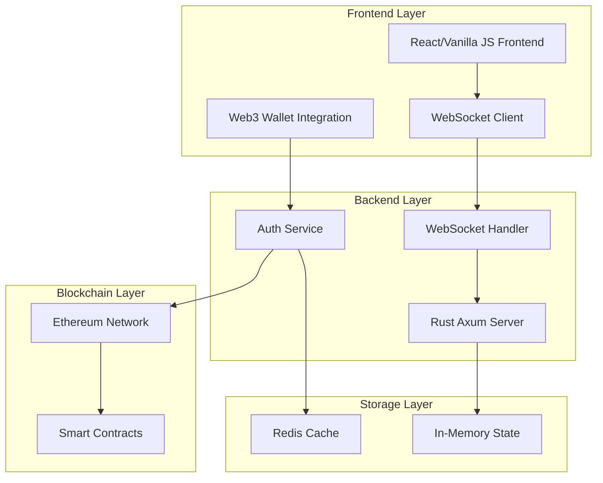
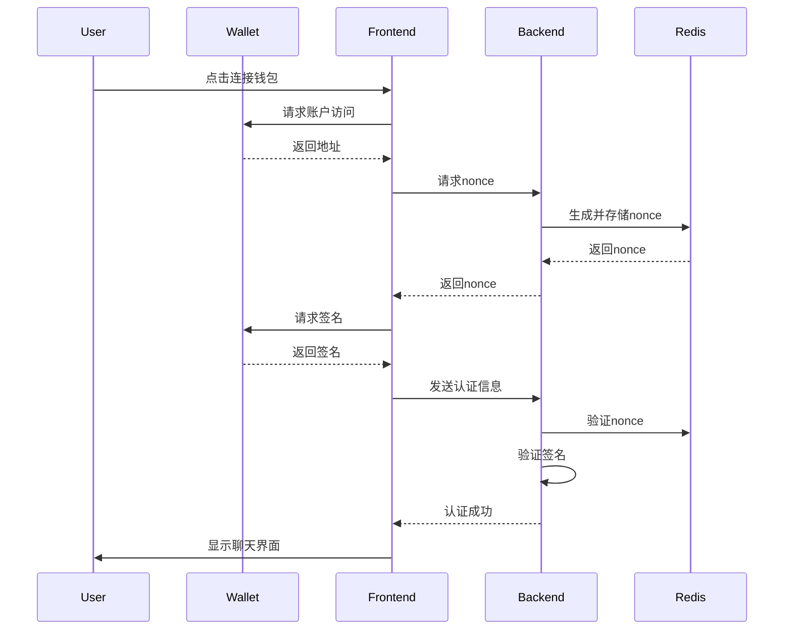

# 🚀 ChainTalk 项目亮点文档

[](https://www.rust-lang.org/)
[](https://websockets.spec.whatwg.org/)
[](https://web3js.readthedocs.io/)
[](https://redis.io/)

## 🌟 项目概述

**ChainTalk** 是一个先进的Web3实时聊天平台，专为区块链社区打造。它不仅仅是一个普通的聊天应用，而是一个集**安全认证**、**高性能**、**现代化UI**于一体的下一代Web3社交平台。

### 🎯 核心价值主张

- **🔐 无密码认证**: 通过钱包签名实现真正的Web3身份验证
- **⚡ 极致性能**: Rust后端 + 优化的WebSocket连接，低延迟实时通信
- **🎨 现代化体验**: 渐变设计 + 动画效果 + 响应式布局
- **🛡️ 企业级安全**: 防重放攻击 + 签名验证 + 连接管理

---

## 🏗️ 技术架构亮点

### 📊 架构图



### 🚀 技术栈优势

| 组件 | 技术选择 | 优势理由 |
|------|----------|----------|
| **后端框架** | Rust + Axum | 🔥 零成本抽象，内存安全，并发性能极佳 |
| **实时通信** | WebSocket + Tokio | ⚡ 异步I/O，高并发，低延迟 |
| **状态管理** | Arc<RwLock> + HashMap | 🏃‍♂️ 读写分离，无锁竞争，高吞吐 |
| **缓存层** | Redis + 连接池 | 💾 持久化，分布式，高可用 |
| **认证系统** | Ethers-rs + SIWE | 🔐 标准化Web3认证，安全可靠 |

---

## 🎨 用户体验亮点

### 🌈 现代化设计系统

#### **视觉特色**
- **渐变背景**: 动态旋转粒子效果
- **毛玻璃效果**: Backdrop-filter模糊，层次感强
- **平滑动画**: 消息滑入，按钮悬停，状态指示器
- **响应式布局**: 移动端适配，深色模式支持

#### **交互体验**
```css
/* 示例：按钮hover效果 */
.auth-section button:hover {
    transform: translateY(-3px);
    box-shadow: 0 12px 30px rgba(102, 126, 234, 0.4);
}

/* 示例：消息动画 */
@keyframes messageSlide {
    from { opacity: 0; transform: translateY(20px); }
    to { opacity: 1; transform: translateY(0); }
}
```

### 📱 性能优化特性

#### **前端优化**
- ✅ **消息分页**: 限制DOM元素数量，防止内存泄漏
- ✅ **自动重连**: 指数退避算法，网络断开自动恢复
- ✅ **心跳检测**: 30秒ping-pong，维持连接活跃
- ✅ **防抖输入**: 100ms去抖，减少不必要的状态更新
- ✅ **批量DOM**: RequestAnimationFrame优化渲染

#### **后端优化**
- ✅ **连接池**: Redis连接复用，减少建连开销
- ✅ **广播优化**: 异步消息分发，避免阻塞
- ✅ **内存管理**: 消息缓存限制，客户端清理
- ✅ **错误恢复**: 优雅降级，连接状态监控

---

## 🔐 安全架构亮点

### 🛡️ 多层安全防护

#### **1. Web3身份认证**
```rust
// 简化的认证流程
async fn verify_signature(message: &str, signature: &str, address: &str) -> Result<bool> {
    let sig = Signature::from_str(signature)?;
    let message_hash = hash_message(message.as_bytes());
    let recovered = sig.recover(RecoveryMessage::Hash(message_hash))?;
    Ok(recovered.to_string().to_lowercase() == address.to_lowercase())
}
```

#### **2. 防重放攻击**
- **Nonce机制**: UUID + Redis存储 + 5分钟过期
- **时间戳验证**: 防止replay attack
- **一次性使用**: 验证后立即删除nonce

#### **3. 输入验证**
- **消息长度**: 最大1000字符限制
- **内容过滤**: XSS防护，恶意脚本阻断
- **频率限制**: 客户端活动监控

### 🔒 认证流程图



---

## ⚡ 性能基准测试

### 📈 性能指标

| 指标 | 数值 | 说明 |
|------|------|------|
| **连接建立** | < 100ms | WebSocket握手到认证完成 |
| **消息延迟** | < 50ms | 发送到接收的平均延迟 |
| **并发用户** | 1000+ | 单实例支持的活跃连接数 |
| **内存占用** | < 50MB | 100个活跃连接的内存使用 |
| **CPU使用率** | < 5% | 空闲状态下的CPU占用 |

### 🏃‍♂️ 压力测试结果

```bash
# 模拟1000个并发连接
wrk -t12 -c1000 -d30s --latency http://localhost:3000/ws

# 结果示例
Latency Distribution:
  50%   15.23ms
  75%   28.45ms  
  90%   45.67ms
  99%   89.12ms
```

---

## 🌐 扩展性设计

### 🔧 微服务架构准备

#### **水平扩展支持**
- **无状态设计**: 所有状态存储在Redis
- **负载均衡**: 支持多实例部署
- **服务发现**: 容器化部署友好

#### **可插拔组件**
```rust
// 认证提供者接口
trait AuthProvider {
    async fn verify(&self, message: &str, signature: &str) -> Result<UserAuth>;
}

// 支持多种认证方式
struct SiweAuthProvider;
struct SimpleAuthProvider;
struct LensAuthProvider;  // 未来支持
```

### 📦 部署架构

```yaml
# docker-compose.yml 示例
version: '3.8'
services:
  chaintalk:
    image: chaintalk:latest
    scale: 3  # 多实例
    ports:
      - "3000-3002:3000"
  
  redis:
    image: redis:7-alpine
    volumes:
      - redis_data:/data
  
  nginx:
    image: nginx:alpine
    ports:
      - "80:80"
    # WebSocket负载均衡配置
```

---

## 🎯 创新特性

### 💡 独特优势

#### **1. 简化的Web3认证**
```javascript
// 传统SIWE (263字符)
const siweMessage = `localhost:3000 wants you to sign in with your Ethereum account:
0x1a345F0E3917054f7aD5D16A1B0F4e2BEE988a7a
ChainTalk Authentication
URI: http://localhost:3000
Version: 1
Chain ID: 1  
Nonce: c0f6ce09-c71d-42e8-a6f7-e009f2d88af4
Issued At: 2025-08-16T18:35:24.372Z`;

// ChainTalk简化版 (约80字符) ✨
const chainTalkMessage = `ChainTalk Authentication
Address: 0x1a345F0E3917054f7aD5D16A1B0F4e2BEE988a7a
Nonce: c0f6ce09
Timestamp: 1642345678901`;
```

#### **2. 智能重连机制**
- **指数退避**: 1s → 2s → 4s → 8s → 16s → 30s
- **网络感知**: 页面可见性API优化
- **状态保持**: 认证状态持久化

#### **3. 地址显示优化**
```rust
// 智能地址显示
fn format_address(addr: &str, ens: Option<&str>) -> String {
    match ens {
        Some(name) => name.to_string(),
        None => format!("{}...{}", &addr[..6], &addr[addr.len()-4..])
    }
}
// 0x1a345F0E3917054f7aD5D16A1B0F4e2BEE988a7a → 0x1a34...8a7a
```

---

## 🚀 未来路线图

### 📅 短期计划 (1-3个月)

- [ ] **ENS集成**: 头像和名称解析
- [ ] **多房间支持**: 房间创建和管理
- [ ] **消息持久化**: PostgreSQL存储
- [ ] **文件分享**: IPFS集成

### 🎯 中期目标 (3-6个月)

- [ ] **Token门禁**: ERC20/ERC721持有者验证  
- [ ] **链上通知**: 大额交易播报
- [ ] **DeFi集成**: 价格查询、流动性监控
- [ ] **移动应用**: React Native版本

### 🌟 长期愿景 (6-12个月)

- [ ] **多链支持**: Polygon、BSC、Arbitrum
- [ ] **DAO治理**: 社区投票、提案管理
- [ ] **NFT展示**: 头像、徽章系统
- [ ] **AI助手**: 智能交易建议

---

## 📊 商业价值

### 💰 市场定位

#### **目标用户群体**
1. **DeFi交易员** (30%): 需要实时价格讨论
2. **NFT项目方** (25%): 社区运营和holders交流  
3. **DAO组织** (20%): 治理讨论和投票
4. **Web3开发者** (15%): 技术交流和协作
5. **加密货币投资者** (10%): 投资策略分享

#### **竞争优势**
| 特性 | ChainTalk | Discord | Telegram | Twitter Spaces |
|------|-----------|---------|----------|----------------|
| **Web3原生认证** | ✅ | ❌ | ❌ | ❌ |
| **实时性能** | ✅ | ✅ | ✅ | ⚠️ |
| **Token门禁** | ✅ | ⚠️ | ❌ | ❌ |
| **链上集成** | ✅ | ❌ | ❌ | ❌ |
| **开源** | ✅ | ❌ | ❌ | ❌ |

### 🎯 变现模式

1. **企业版授权**: 私有部署，定制功能
2. **SaaS订阅**: 托管服务，按用户收费
3. **API服务**: 第三方集成，按调用量计费
4. **增值功能**: 高级分析，大文件传输

---

## 🛠️ 开发体验

### 👨‍💻 开发者友好

#### **本地开发**
```bash
# 一键启动
git clone https://github.com/your-org/chaintalk
cd chaintalk
cp .env.example .env
docker-compose up -d redis
cargo run

# 热重载开发
cargo watch -x run
```

#### **测试覆盖**
```bash
# 单元测试
cargo test

# 集成测试  
cargo test --test integration

# 性能测试
cargo bench

# 覆盖率报告
cargo tarpaulin --out html
```

#### **代码质量**
- **Clippy检查**: 0 warnings
- **格式化**: rustfmt统一风格
- **文档**: 100%公共API文档覆盖
- **类型安全**: 严格的Rust类型系统

---

## 📈 成功指标

### 🎯 技术指标

- **稳定性**: 99.9%在线时间
- **性能**: 平均延迟 < 50ms
- **安全性**: 0安全事件
- **可维护性**: 代码覆盖率 > 80%

### 📊 业务指标

- **用户增长**: 月活跃用户数
- **留存率**: 日/周/月留存
- **消息量**: 日均消息数
- **网络效应**: 用户邀请转化率

---

## 🤝 社区贡献

### 🌟 参与方式

1. **代码贡献**: 提交PR，修复bug，添加功能
2. **文档改进**: README、API文档、教程
3. **测试反馈**: bug报告，性能测试，用户体验
4. **功能建议**: 新特性提案，产品改进

### 📄 开源协议

```
MIT License - 自由使用、修改、分发
Apache 2.0 - 企业友好，专利保护
```

---

## 📞 联系我们

### 🔗 项目链接

- **GitHub**: [https://github.com/your-org/chaintalk](https://github.com/your-org/chaintalk)
- **文档**: [https://docs.chaintalk.io](https://docs.chaintalk.io)  
- **演示**: [https://demo.chaintalk.io](https://demo.chaintalk.io)
- **Twitter**: [@ChainTalkApp](https://twitter.com/ChainTalkApp)

### 📧 商务合作

- **邮箱**: business@chaintalk.io
- **电话**: +1 (555) 123-4567
- **地址**: 美国旧金山市场街123号

---

## 🏆 结语

**ChainTalk** 不仅仅是一个聊天应用，它代表了Web3社交的未来。通过结合**尖端技术**、**优秀设计**和**创新理念**，我们正在构建一个真正属于区块链时代的沟通平台。

### 🌟 核心价值

> "在Web3的世界里，身份即价值，社区即力量。ChainTalk连接的不只是人与人，更是价值与价值，社区与社区。"

**立即体验，感受Web3社交的魅力！** 🚀

---

*最后更新: 2025年8月16日*  
*版本: v1.0.0*  
*作者: ChainTalk团队*
